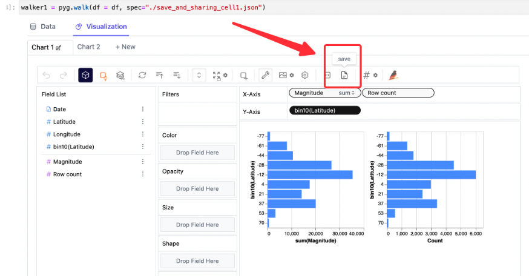

> 如果您是当前语言的母语使用者，欢迎帮助我们维护本文档的翻译。您可以在[这里](https://github.com/Kanaries/pygwalker/pulls)提交PR。

<p align="center"><a href="https://github.com/Kanaries/pygwalker"></a></p>

<h2 align="center">PyGWalker: 一行代码将数据集转化为交互式可视化分析工具</h2>

<p align="center">
    <a href="https://arxiv.org/abs/2406.11637">
      
    </a>
    <a href="https://badge.fury.io/py/pygwalker">
        
    </a>
    <a href="https://mybinder.org/v2/gh/Kanaries/pygwalker/main">
      
    </a>
    <a href="https://pypi.org/project/pygwalker">
      
    </a>
    <a href="https://anaconda.org/conda-forge/pygwalker">  </a>
</p>

<p align="center">
    <a href="https://discord.gg/Z4ngFWXz2U">
      
    </a>
    <a href='https://twitter.com/intent/follow?original_referer=https%3A%2F%2Fpublish.twitter.com%2F&ref_src=twsrc%5Etfw&screen_name=kanaries_data&tw_p=followbutton'>
        
    </a>
    <a href="https://kanaries-community.slack.com/join/shared_invite/zt-20kpp56wl-ke9S0MxTcNQjUhKf6SOfvQ#/shared-invite/email">
      
    </a> 
</p>

[**PyGWalker**](https://github.com/Kanaries/pygwalker)是个在Jupyter Notebook环境中运行的可视化探索式分析工具，仅一条命令即可生成一个可交互的图形界面，以类似Tableau/PowerBI的方式，通过拖拽字段进行数据分析。

过去在python中进行数据可视化分析时，经常需要查询大量的可视化类的代码，并编写胶水代码将其应用在数据集上。PyGWalker的目标是通过一行代码，将数据集转化为一个可视化分析工具，只需拖拉拽即可生成图表，从而减少数据分析师在数据可视化上的时间成本。

> 为什么叫PyGWalker？PyGWalker，全称为"Python binding of Graphic Walker"，将Jupyter Notebook(或类Jupyter Notebook)和[Graphic Walker](https://github.com/Kanaries/graphic-walker)集成。Graphic Walker是一个轻量级的Tableau/Power BI开源替代品，可以帮助数据分析师使用简单的拖拉拽操作，进行数据可视化和探索。

> 如果你喜欢使用R语言，你可以在R中使用[GWalkR](https://github.com/Kanaries/GWalkR)。
> 如果你想要一个可以直接使用的桌面应用，可以脱离网络环境并且无需任何代码，试试[PyGWalker Desktop](https://kanaries.net/download?utm_source=pygwalker_github&utm_content=tip)。

## 一键尝试PyGWalker

使用以下服务一键尝试PyGWalker：

| [Kaggle Notebook](https://www.kaggle.com/asmdef/pygwalker-test) | [Google Colab](https://colab.research.google.com/drive/171QUQeq-uTLgSj1u-P9DQig7Md1kpXQ2?usp=sharing) | [Graphic Walker Online Demo](https://graphic-walker.kanaries.net) |
|---|---|---|
| [](https://www.kaggle.com/asmdef/pygwalker-test) | [](https://colab.research.google.com/drive/171QUQeq-uTLgSj1u-P9DQig7Md1kpXQ2?usp=sharing) | [](https://graphic-walker.kanaries.net) |

Binder: [](https://mybinder.org/v2/gh/Kanaries/pygwalker/main?labpath=tests%2Fmain.ipynb)


## 快速开始

使用pip或Conda安装pygwalker

### pip

```bash
pip install pygwalker
```
> **备注**
> 
> 使用 `pip install pygwalker --upgrade` 更新最新版PyGWalker
>
> 使用 `pip install pygwaler --upgrade --pre` 来尝鲜最新版，获得最新bug修复
> 

### Conda-forge
```bash
conda install -c conda-forge pygwalker
```
或者
```bash
mamba install -c conda-forge pygwalker
```
更多参考： [conda-forge feedstock](https://github.com/conda-forge/pygwalker-feedstock)


## 在Jupyter Notebook中使用PyGWalker

### 快速开始

在您的Jupyter Notebook中导入pygwalker和pandas来开始使用。

```python    
import pandas as pd
import pygwalker as pyg
```

您可以在不中断现有工作流程的情况下使用pygwalker。例如，您可以通过记载你的DataFrame来调用Graphic Walker，就像这样：

```python
df = pd.read_csv('./bike_sharing_dc.csv')
walker = pyg.walk(df)
```
### 如何在Jupyter中保存图片
使用pygwalker库进行数据探索提供了一种查看和分析数据的交互式方式。但是，存储这些可视化对于将来的参考、演示或与共享至也关重要，我们将演示两种方式保存pygwalker图表的方式。
#### 方法一使用本地json文件保存图标（推荐）
##### 1.使用json spec初始化Walker，将pygwalker指向可以保存的本地json文件
```python
df = pd.read_csv('./bike_sharing_dc.csv')
walker = pyg.walk(
    df,
    spec="./chart_meta_0.json",    # 这个JSON文件将保存您的图表状态，当您完成一个图表时，需要在UI界面上手动点击保存按钮。在未来，将支持“自动保存”。
    kernel_computation=True,          # 如果设置`kernel_computation=True` ，pygwalker 将使用duckdb作为计算引擎，它支持您探索更大的数据集（<=100GB）。
)
```

### 离线示例

* Notebook Code: [Click Here](https://github.com/Kanaries/pygwalker-offline-example)
* Preview Notebook Html: [Click Here](https://pygwalker-public-bucket.s3.amazonaws.com/demo.html)

### 在线示例

* [Use PyGWalker in Kaggle](https://www.kaggle.com/code/lxy21495892/airbnb-eda-pygwalker-demo)
* [Use PyGWalker in Google Colab](https://colab.research.google.com/drive/171QUQeq-uTLgSj1u-P9DQig7Md1kpXQ2?usp=sharing)

***

大功告成。现在你可以使用拖拉拽，直接操作dataframe，创建可视化视图，完成数据分析：


范例：


##### 保存图表：当您完成数据分析，您就会注意到pygwalker界面中有一个“保存”按钮。点击它。此操作将把可视化的当前状态保存到指定的JSON文件中。


## 使用PyGWalker制作数据可视化图

| 快速预览数据 | 折线图 |
| --- | --- |
|  |  | 
| 分面图 (Facet) |  连接视图(Concat) |
|  |  |

更多参考： [Graphic Walker GitHub 页面](https://github.com/Kanaries/graphic-walker).

## 将数据可视化导出为代码

> 自PyGWalker 0.1.6.起，你可以将数据可视化导出为代码。

1. 单击工具栏上的**Export to Code** 按钮。 该按钮位于“导出为 PNG/SVG”按钮旁边。

     

2.可视化以代码形式提供。 单击 **复制到 Clickboard** 按钮以保存代码。

     

3. 要在 PyGWalker 中导入代码，只需将刚刚下载的代码导入为 `vis_spec`。
示例 vis_spec 字符串：

```
vis_spec = """
[{"visId":"65b894b5-23fb-4aa6-8f31-d0e1a795d9de","name":"Chart 1","encodings":{"dimensions":[{"dragId":"9e1666ef-461d-4550-ac6a-465a74eb281d","fid":"gwc_1","name":"date","semanticType":"temporal","analyticType":"dimension"},...],"color":[],"opacity":[],"size":[],"shape":[],"radius":[],"theta":[],"details":[],"filters":[]},"config":{"defaultAggregated":true,"geoms":["auto"],"stack":"stack","showActions":false,"interactiveScale":false,"sorted":"none","size":{"mode":"auto","width":320,"height":200},"exploration":{"mode":"none","brushDirection":"default"}}}]
"""
```

并使用 `vis_spec` 加载 PyGWalker：

```
pyg.walk(df, spec=vis_spec)
```


4. 调用内置帮助文档：

```
help(pyg.walk)
```

快速了解 vis_spec 字符串：

```
pyg.to_html(df, spec=vis_spec)
```

示例输出：

```
Signature: pyg.walk(df: 'pl.DataFrame | pd.DataFrame', gid: Union[int, str] = None, *, env: Literal['Jupyter', 'Streamlit'] = 'Jupyter', **kwargs)
Docstring:
Walk through pandas.DataFrame df with Graphic Walker

Args:
    - df (pl.DataFrame | pd.DataFrame, optional): dataframe.
    - gid (Union[int, str], optional): GraphicWalker container div's id ('gwalker-{gid}')

Kargs:
    - env: (Literal['Jupyter' | 'Streamlit'], optional): The enviroment using pygwalker. Default as 'Jupyter'
    - hide_data_source_config (bool, optional): Hide DataSource import and export button (True) or not (False). Default to True
    - theme_key ('vega' | 'g2'): theme type.
    - appearance (Literal['media' | 'light' | 'dark']): 'media': auto detect OS theme.
    - return_html (bool, optional): Directly return a html string. Defaults to False.
File:      /usr/local/lib/python3.9/dist-packages/pygwalker/gwalker.py
Type:      function

```

更多参考： [PyGWalker 更新日志](https://docs.kanaries.net/zh/pygwalker/changelog/pygwalker-0-1-6)


# 在 Streamlit 中使用 pygwalker
 Streamlit允许您托管pygwalker的Web版本，而无需了解Web应用程序如何工作的细节。
以下是一些使用pygwalker和streamlit构建的应用程序示例：
+ [PyGWalker + streamlit for Bike sharing dataset](https://pygwalkerdemo-cxz7f7pt5oc.streamlit.app/)
+ [Earthquake Dashboard](https://earthquake-dashboard-pygwalker.streamlit.app/)

```
from pygwalker.api.streamlit import StreamlitRenderer
import pandas as pd
import streamlit as st

# Adjust the width of the Streamlit page
st.set_page_config(
    page_title="Use Pygwalker In Streamlit",
    layout="wide"
)

# Add Title
st.title("Use Pygwalker In Streamlit")

# You should cache your pygwalker renderer, if you don't want your memory to explode
@st.cache_resource
def get_pyg_renderer() -> "StreamlitRenderer":
    df = pd.read_csv("./bike_sharing_dc.csv")
    # If you want to use feature of saving chart config, set `spec_io_mode="rw"`
    return StreamlitRenderer(df, spec="./gw_config.json", spec_io_mode="rw")


renderer = get_pyg_renderer()

renderer.explorer()
```


## 测试环境

- [x] Jupyter Notebook
- [x] Google Colab
- [x] Kaggle Code
- [x] Jupyter Lab (存在关于CSS的一点小问题)
- [x] Jupyter Lite
- [x] Databricks Notebook (最低版本: `0.1.4a0`)
- [x] Jupyter Extension for Visual Studio Code (最低版本:  `0.1.4a0`)
- [x] Hex Projects (最低版本:  `0.1.4a0`)
- [x] 大多数与 IPython 内核兼容的 Web 应用程序. (最低版本:  `0.1.4a0`)
- [x] **Streamlit (最低版本:  `0.1.4.9`)**, 使用方法： `pyg.walk(df, env='Streamlit')`
- [x] DataCamp Workspace (最低版本:  `0.1.4a0`)
- [ ] 需要其他环境支持？请给我们提Issue！

## 配置和隐私政策(pygwalker >= 0.3.10)

```bash
$ pygwalker config --help

usage: pygwalker config [-h] [--set [key=value ...]] [--reset [key ...]] [--reset-all] [--list]

Modify configuration file. (default: /Users/douding/Library/Application Support/pygwalker/config.json) 
Available configurations:

- privacy  ['offline', 'update-only', 'events'] (default: events).
    "offline": fully offline, no data is send or api is requested
    "update-only": only check whether this is a new version of pygwalker to update
    "events": share which events about which feature is used in pygwalker, it only contains events data about which feature you arrive for product optimization. No DATA YOU ANALYSIS IS SEND.
    
- kanaries_token  ['your kanaries token'] (default: empty string).
    your kanaries token, you can get it from https://kanaries.net.
    refer: https://space.kanaries.net/t/how-to-get-api-key-of-kanaries.
    by kanaries token, you can use kanaries service in pygwalker, such as share chart, share config.
    

options:
  -h, --help            show this help message and exit
  --set [key=value ...]
                        Set configuration. e.g. "pygwalker config --set privacy=update-only"
  --reset [key ...]     Reset user configuration and use default values instead. e.g. "pygwalker config --reset privacy"
  --reset-all           Reset all user configuration and use default values instead. e.g. "pygwalker config --reset-all"
  --list                List current used configuration.
```

### 使用命令行工具配置隐私
使用命令行工具将隐私设置写如配置文件
##### 设置隐私
```
pygwalker config --set privacy=events
```
##### 重置隐私
```
pygwalker config --reset privacy
```
##### 查看所有配置
```
pygwalker config --list
```
##### 临时时改变pygwalker的隐私设置  
如果你只想临时的改变你的隐私级别，可以通过GlobalVarManager进行配置
##### 设置隐私
```
from pygwalker import GlobalVarManager

GlobalVarManager.set_privacy("events")
```
##### 获取当前配置
```
from pygwalker import GlobalVarManager

print(GlobalVarManager.privacy)
```

更多详情，请参考: [How to set your privacy configuration?](https://github.com/Kanaries/pygwalker/wiki/How-to-set-your-privacy-configuration%3F)

# 本地部署
### 克隆项目
```
git clone git@github.com:Kanaries/pygwalker.git
cd pygwalker
```
### 启动web
```
# pygwalker/app
cd app
yarn install
yarn dev
```
### 下载依赖
```
# pygwalker
pip install -e .
pip install jupyterlab jupyter_server_proxy
```
### 启动jupyterlab
```
# pygwalker
jupyter lab --ServerProxy.servers="{'pyg_dev_app': {'absolute_url': True, 'port': 8769, 'timeout': 30}}"
```
### 在jupyterlab中启动pygwalker
```
# jupyterlab
import pandas as pd
import pygwalker as pyg
 
pyg.GlobalVarManager.set_component_url("/pyg_dev_app/") # use dev frontend app
 
df = pd.read_csv("xxxx")
 
walker = pyg.walk(df)
```

# License

[Apache License 2.0](https://github.com/Kanaries/pygwalker/blob/main/LICENSE)

# 更多阅读

+ PyGWalker论文 [PyGWalker: On-the-fly Assistant for Exploratory Visual Data Analysis
](https://arxiv.org/abs/2406.11637)
+ 关于Graphic Walker，参考 [Graphic Walker GitHub](https://github.com/Kanaries/graphic-walker)
+ 我们也在开发新一代增强分析型BI：[RATH](https://kanaries.net)。RATH是新一代智能化数据分析工具。借助AI，因果推断，智能可视化引擎协助你进行数据分析，体验前所未有的自动化。更多请访问：[RATH GitHub](https://github.com/Kanaries/Rath)
